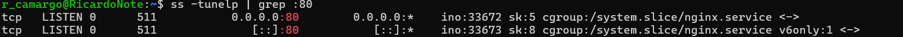

# __Atividade prática 1 - DevSecOps Compass UOL__
## Prática realizada no programa de bolsas da Compass UOL na trilha de DevSecOps/Out2024</h2>
<h3>Objetivos:</h3>

<ul>
  <li>Instalar o WSL e o UBUNTU 22.04 LTS;</li>
  <li>Subir um servidor Nginx, online e funciona;</li>
  <li>Criar um script que valide se o serviço está online e envie o resultado da validação para um diretório definido</li>
  <li>Script deve conter - Data + HORA + nome do serviço + Status + mensagem personalizada de <strong>ONLINE</strong> ou <strong>OFFLINE</strong></li>
  <li>Automatizar a execução do script de 5 em 5 minutos.</li>
  <li>Fazer o versionamento da atividade através do GitHub.</li>
  <li>Realizar a documentação do processo de instalação do Linux, instalação e funcionamento do servidor NGINX, script utilizado e processo de automatização.</li>
</ul>

## __ÍNDICE__
### 1. [Ativação do WSL]


---

### 1. Ativação do WSL
Para ativar o Windows Subsystem for Linux (WSL) no Windows, execute os seguintes passos:

#### 1.1 Abra o PowerShell com permissões de administrador e execute o comando:

```powershell
wsl --install
```
#### 1.3 Reinicie o sistema após a instalação, se solicitado.

### 2. Instalação do Ubuntu 22.04 LTS

#### 2.1 Abra a Microsoft Store.

#### 2.2 Busque por "Ubuntu 22.04 LTS".

#### 2.3 Clique em Obter e instale a distribuição.

### 3. Instalação do NGINX no Ubuntu

#### 3.1 Após instalar o Ubuntu, siga as etapas para instalar o NGINX:

#### 3.2 Abra o terminal do Ubuntu.

#### 3.3 Atualize os pacotes:


#### 3.4 Instale o NGINX:

.png)

#### 3.5 Verifique o status do serviço:

```bash
service nginx status
```


### 4 Configuração de Permissões e Criação de Logs
#### 4.1 Verifique a porta utilizada pelo NGINX:

```bash
ss -tunelp | grep :80
```


#### 4.2 Verifique se está funcional em seu navegador por meio do IP ou localhost:


#### 4.3 Configure as permissões de escrita na pasta /var/log/nginx para criar logs personalizados:

```bash
sudo chmod 722 /var/log/nginx
```


#### 4.3 Crie os arquivos de log:

```bash
sudo touch /var/log/nginx/servico_online.log
sudo touch /var/log/nginx/servico_offline.log
````

 
### 5. Criação do Script de Verificação de Status

#### 5.1 Crie o diretório e o script de monitoramento de status do servidor NGINX:

```bash
sudo mkdir /scripts
```

#### 5.2 Crie o arquivo verifica_servidor.sh dentro do diretório scripts:

```bash
sudo vi /scripts/verifica_servidor.sh
```

#### 5.3 Script que verifica o funcionamento do serviço:


O script tem a função de quando executado gravar uma mensagem com data-hora, serviço e estado de funcionamento do serviço e enviar para distintos logs.

* Se o NGINX estiver ativo: grava uma entrada com data e hora no arquivo servico_online.log.

* Se o NGINX estiver inativo: grava uma entrada com data e hora no arquivo servico_offline.log.


#### 5.4 Dê permissão de execução ao script:


#### 5.5 Executando o script:
* Nginx online


* Nginx offline

 

### 6. Automatização da Execução do Script

#### 6.1 Para automatizar a execução do script de cinco em cinco minutos, edite o cron:

Para a automatização da execução do programa, foi utilizado o cron que permite programar tarefas para serem executadas de maneira independente.

Abra o cron com o comando:

```bash
sudo crontab -e
```

#### 6.2 Adicione a seguinte linha ao final do arquivo:

```bash
*/5 * * * * /scripts/verifica_servidor.sh
```

* Logs quando o sistema está online:


* Logs quando o sistema está offline:


---

Por meio desta documentação é possível 

